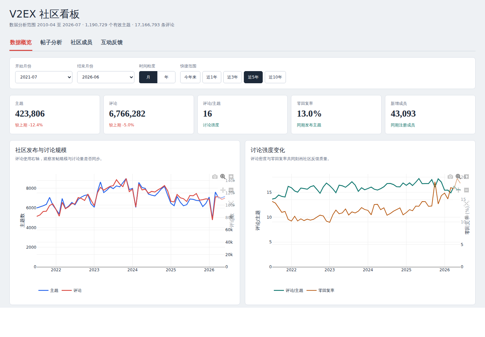
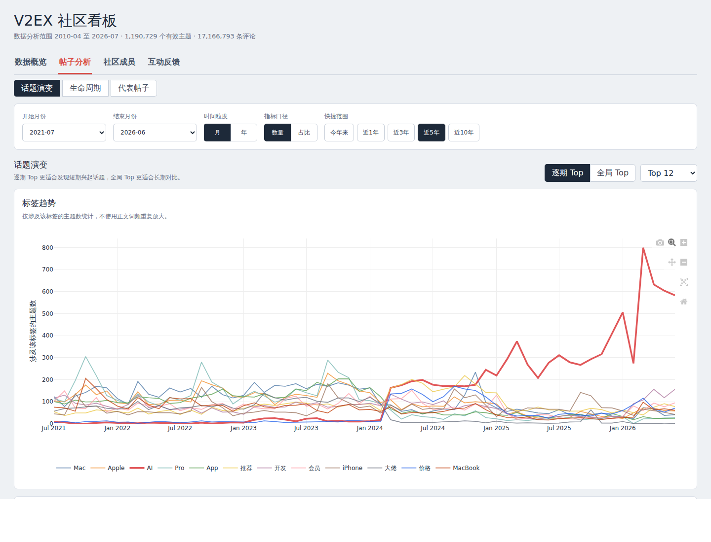

# V2EX Scrapy

[English](README-en.md)

V2EX 全站主题、评论和成员爬虫，附带按时间、话题、节点、成员和互动指标分析的 Vue 仪表盘。数据保存到根目录 `v2ex.sqlite`。

当前本地数据截至 2026-07-05：主题 ID 已覆盖 `1..1225000`，其中有效主题 1,190,729 条、评论 17,166,793 条、成员记录 246,276 条。删除、登录可见或受限主题会以占位记录保留，因此 ID 数量不等于有效主题数。

## 界面预览

### 数据概览



### 帖子分析



## 环境与配置

需要 Python 3.10+ 和 Node.js 18+：

```bash
python -m venv .venv
.venv/bin/pip install -r requirements.txt
cp .env.example .env
set -a; source .env; set +a
```

环境变量包括 `V2EX_COOKIES_FILE`、`V2EX_PROXIES`、`V2EX_CONCURRENT_REQUESTS` 和 `V2EX_SCRAPY_LOG_TO_FILE`，配置示例见 `.env.example`。

## 爬取与补抓

优先使用小范围验证：

```bash
.venv/bin/scrapy crawl v2ex -a start_id=1224000 -a end_id=1225000
.venv/bin/scrapy crawl v2ex -a topic_ids=100-120,205 -a force_update=true
.venv/bin/scrapy crawl v2ex-node -a node=python
.venv/bin/scrapy crawl v2ex-member -a start_id=1 -a end_id=100
```

扫描并补抓指定上限内的缺失主题：

```bash
.venv/bin/python scripts/backfill_missing_topics.py --end-id 1225000
```

爬虫会跳过完整记录，并补抓缺失主题、空节点或评论数不足的主题。保持低并发，遇到持续 403/429 时停止并等待限制解除。

## 数据分析

更新数据库后生成只读聚合库和前端 JSON：

```bash
.venv/bin/python analysis/build_analytics.py
cd analysis/v2ex-analysis
npm install
npm run dev -- --host 0.0.0.0
```

访问 `http://localhost:5173/`。仪表盘默认显示截至最近完整月的 5 年数据，并排除进行中的月份。生产构建：

```bash
npm run build
```

收藏、感谢和投票只有当前快照，没有互动发生时间；相关趋势按内容发布时间分组，不代表对应月份实际发生的互动。

主要视图包括：

- 数据概览：主题、评论、成员和活跃时段。
- 帖子分析：话题演变、帖子生命周期和代表帖子。
- 社区成员：节点迁移、成员增长与参与结构。
- 互动反馈：点击、收藏、感谢、投票及标准化互动率。

## 测试

```bash
.venv/bin/python -m unittest discover -s tests -p 'test_*.py'
cd analysis/v2ex-analysis && npm run build
```

完整数据库体积较大，不纳入 Git。历史数据库可从项目 Releases 获取。

## 来源与维护说明

本项目基于 [oldshensheep/v2ex_scrapy](https://github.com/oldshensheep/v2ex_scrapy) 继续维护和扩展。当前版本的爬取可靠性改进、历史数据补抓工具、分析聚合及可视化看板由 Codex (GPT-5.5) 协助重构与实现。
