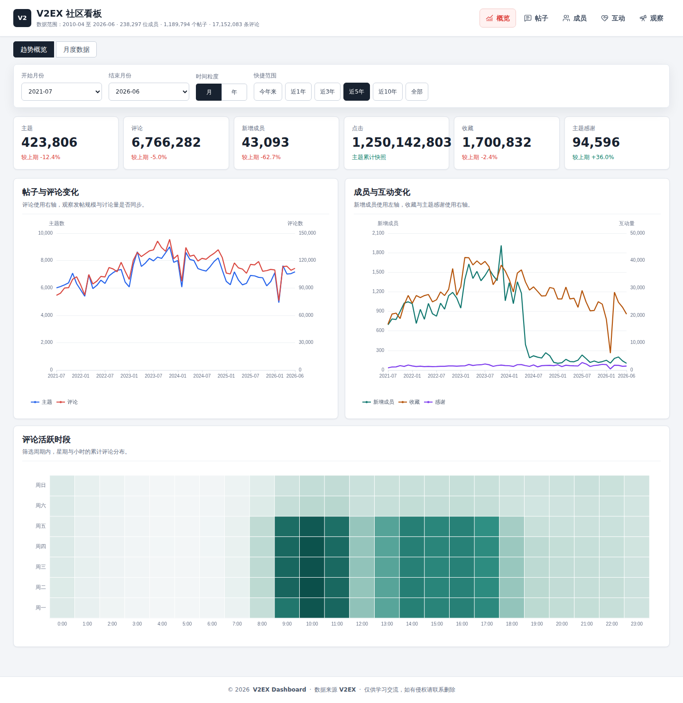
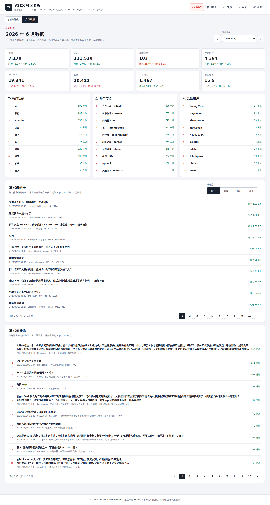
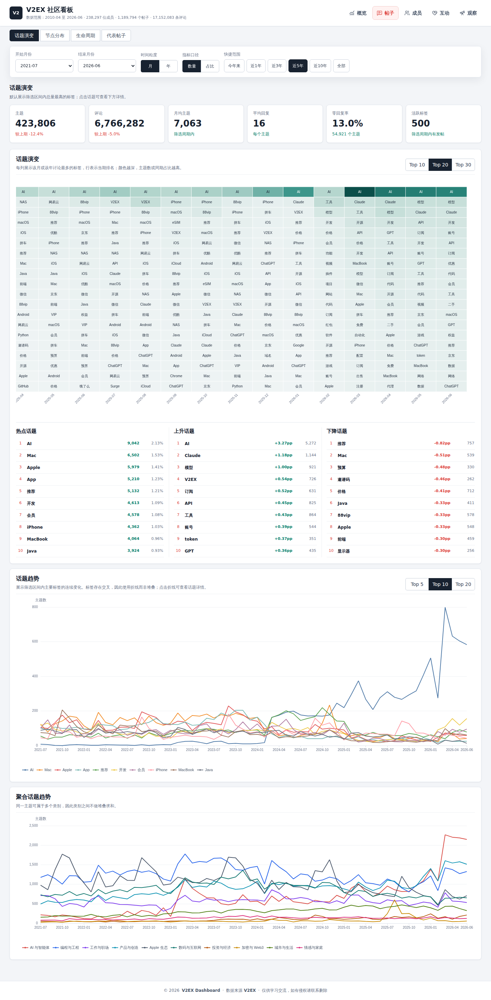
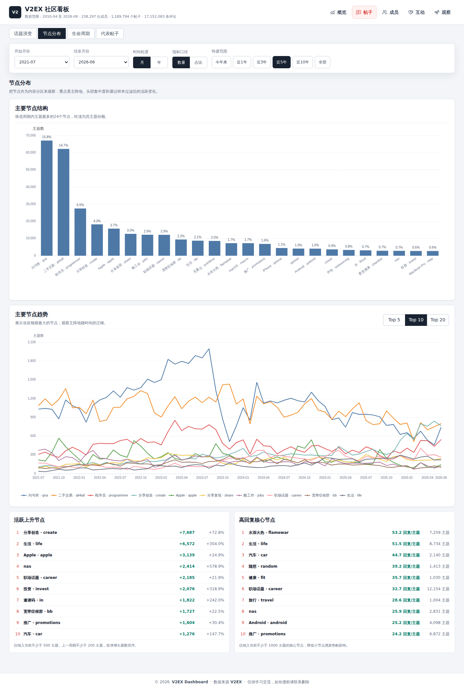
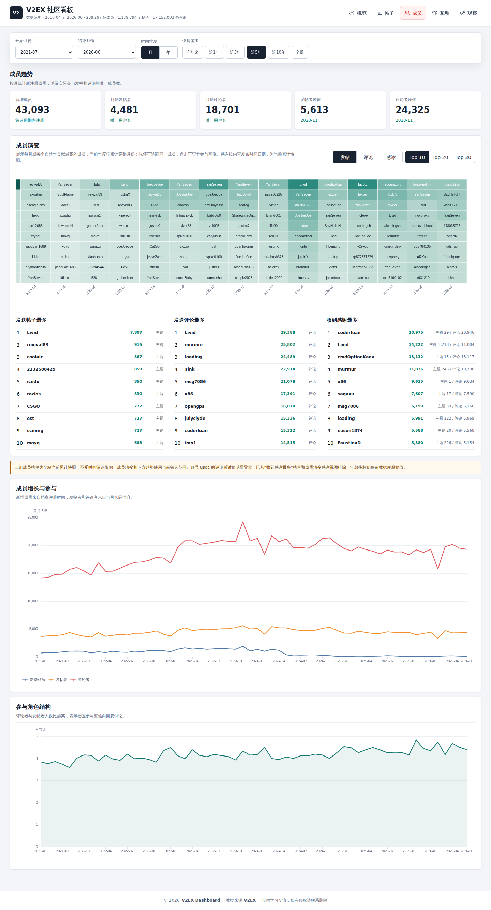
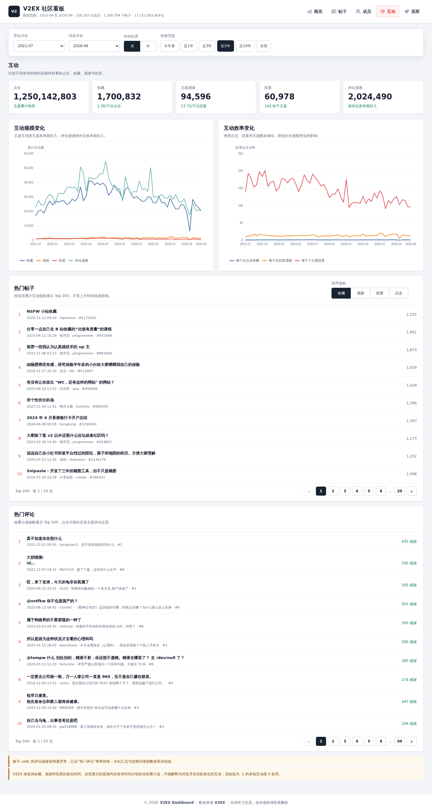
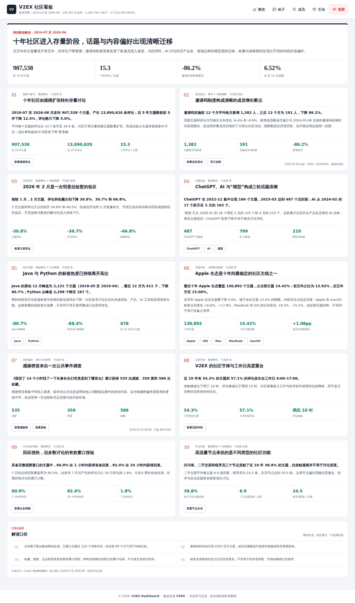

# V2EX Dashboard

V2EX 全站主题、评论和成员爬虫，附带按时间、话题、节点、成员和互动指标分析的 Vue 仪表盘。看板支持可分享 URL、月度数据、事件注释、有限成员参与画像和离线社区观察。数据保存到根目录 `v2ex.sqlite`。

当前本地数据截至 2026-07-05：主题 ID 已覆盖 `1..1225000`，其中有效主题 1,190,729 条、评论 17,166,793 条、成员记录 246,276 条。删除、登录可见或受限主题会以占位记录保留，因此 ID 数量不等于有效主题数。

指标定义、分析方法、当前数据观察及使用限制见 [数据分析说明](DATA_ANALYSIS.md)。

## 界面预览

### 概览



### 月度数据



### 帖子



### 节点分布



### 成员



### 互动



### 观察



## 环境与配置

需要 Python 3.10+ 和 Node.js 18+：

```bash
python -m venv .venv
.venv/bin/pip install -r requirements.txt
cp .env.example .env
set -a; source .env; set +a
```

环境变量包括 `V2EX_COOKIES_FILE`、`V2EX_PROXIES`、`V2EX_CONCURRENT_REQUESTS` 和 `V2EX_SCRAPY_LOG_TO_FILE`，配置示例见 `.env.example`。

## 爬取与补抓

优先使用小范围验证：

```bash
.venv/bin/scrapy crawl v2ex -a start_id=1224000 -a end_id=1225000
.venv/bin/scrapy crawl v2ex -a topic_ids=100-120,205 -a force_update=true
.venv/bin/scrapy crawl v2ex-node -a node=python
.venv/bin/scrapy crawl v2ex-member -a start_id=1 -a end_id=100
```

扫描并补抓指定上限内的缺失主题：

```bash
.venv/bin/python scripts/backfill_missing_topics.py --end-id 1225000
```

爬虫会跳过完整记录，并补抓缺失主题、空节点或评论数不足的主题。保持低并发，遇到持续 403/429 时停止并等待限制解除。

## 数据分析

更新数据库后生成只读聚合库和前端 JSON；源库未变化时可跳过全量构建：

```bash
.venv/bin/python analysis/build_analytics.py --if-changed
cd analysis/v2ex-analysis
npm install
npm run dev -- --host 0.0.0.0
```

仅更新热门帖子 Top 200 和热门评论 Top 500，无需重建其他聚合数据：

```bash
.venv/bin/python analysis/build_analytics.py --engagement-only
```

仅更新成员月度/年度 Top 30 排名：

```bash
.venv/bin/python analysis/build_analytics.py --community-only
```

仅更新有限成员参与画像分片：

```bash
.venv/bin/python analysis/build_analytics.py --member-profiles-only
```

仅更新标签关联详情：

```bash
.venv/bin/python analysis/build_analytics.py --tag-details-only
```

仅更新代表帖候选（每月全站 Top 30，并排除推广节点）：

```bash
.venv/bin/python analysis/build_analytics.py --representative-only
```

仅更新月度帖子四指标 Top 100 和感谢评论 Top 100 年度分片：

```bash
.venv/bin/python analysis/build_analytics.py --monthly-rankings-only
```

仅根据现有聚合 JSON 更新离线观察与点评：

```bash
.venv/bin/python analysis/build_analytics.py --observations-only
```

访问 `http://localhost:5173/`。仪表盘默认显示截至最近完整月的 5 年数据，并排除进行中的月份。生产构建：

```bash
npm run build
```

收藏、感谢和投票只有当前快照，没有互动发生时间；相关趋势按内容发布时间分组，不代表对应月份实际发生的互动。

主要视图包括：

- 概览：帖子、成员、互动和活跃时段的全局变化，以及可自由选择月份的月度数据。
- 帖子：标签话题演变、聚合话题、节点分布、生命周期和代表帖子。
- 成员：成员增长、参与结构、逐期成员演变及累计贡献榜。
- 互动：点击、收藏、感谢、投票及标准化互动率。
- 观察：基于固定比较窗口生成的离线点评、背景事件和证据链接。

“月度数据”位于概览的二级视图，可选择任意完整月份，并集中查看当月环比、同比、热门话题、热门节点和活跃用户。代表帖子按综合、收藏、感谢、点击分别从当月全量帖子中选取 Top 100，代表评论按感谢选取 Top 100，均以 10 条分页展示。月度摘要和榜单按年份分片加载，不会为单个月份下载完整的话题、节点和成员历史。

使用仓库内的 Nginx 配置构建静态站点容器：

```bash
cd analysis/v2ex-analysis
npm run build
docker compose up -d --build
```

容器仅监听 `127.0.0.1:3090`，由宿主机 Web 服务反向代理。JSON 启用 Gzip 和短期缓存，带哈希的前端资源使用长期不可变缓存。

## 测试

```bash
.venv/bin/python -m unittest discover -s tests -p 'test_*.py'
.venv/bin/python scripts/validate_analytics.py
cd analysis/v2ex-analysis
npx playwright install chromium  # 首次运行
npm run build
npm run test:e2e
```

完整数据库体积较大，不纳入 Git。历史数据库可从项目 Releases 获取。

## 来源与维护说明

本项目基于 [oldshensheep/v2ex_scrapy](https://github.com/oldshensheep/v2ex_scrapy) 继续维护和扩展。当前版本的爬取可靠性改进、历史数据补抓工具、分析聚合及可视化看板由 Codex (GPT-5.6 Sol) 协助重构与实现。
