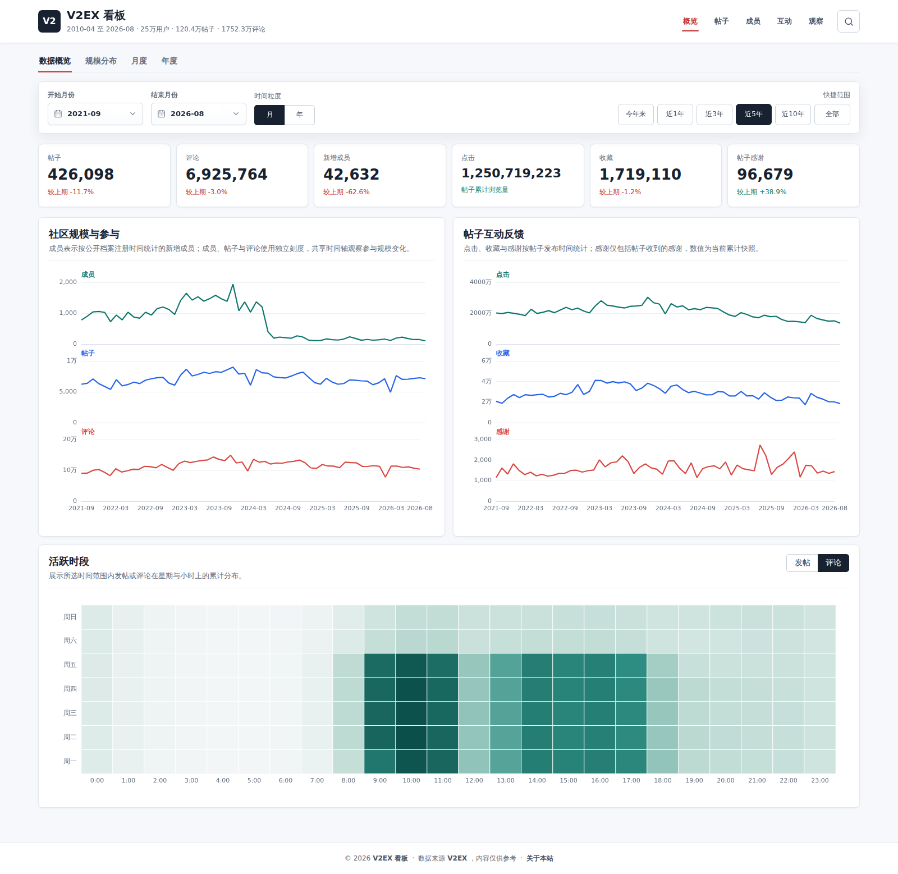
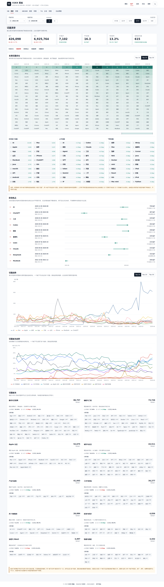
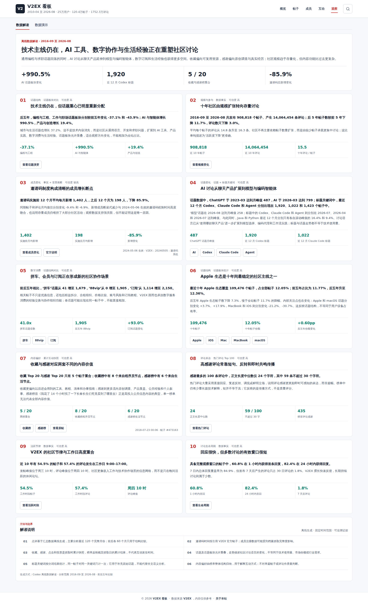

# V2EX Dashboard

V2EX 全站帖子、评论和成员爬虫，附带按时间、话题、标题热词、节点、成员和互动指标分析的 Vue 仪表盘。看板支持可分享 URL、月度与年度数据、事件注释、有限成员详情和离线社区观察。数据保存到根目录 `v2ex.sqlite`。本项目为非官方社区数据项目。

当前本地数据完整覆盖截至 2026-07-31：帖子 ID 已覆盖 `1..1231354`，其中有效帖子 1,197,069 条、评论 17,259,637 条、成员记录 246,971 条。删除、登录可见或受限帖子会以占位记录保留，因此 ID 数量不等于有效帖子数。

指标定义、分析方法、当前数据观察及使用限制见 [数据分析说明](DATA_ANALYSIS.md)；项目演进、踩坑记录和可复用的论坛分析方法见 [项目复盘](PROJECT_RETROSPECTIVE.md)。

界面将 V2EX 帖子携带的原始标签统一称为“话题”；标题分词产生的“内容热词”独立统计，不等同于话题。

## 界面预览

### 概览



### 话题演变



### 社区观察



更多视图：[全局搜索](demo/dashboard-search.png) · [月度数据](demo/dashboard-monthly.png) · [年度数据](demo/dashboard-annual.png) · [内容演变与详情](demo/dashboard-content-hotspots.png) · [节点分布](demo/dashboard-nodes.png) · [节点详情](demo/dashboard-node-detail.png) · [成员趋势](demo/dashboard-members.png) · [互动分析](demo/dashboard-engagement.png)

## 环境与配置

需要 Python 3.10+ 和 Node.js 18+：

```bash
python -m venv .venv
.venv/bin/pip install -r requirements.txt
cp .env.example .env
set -a; source .env; set +a
```

环境变量包括 `V2EX_COOKIES_FILE`、`V2EX_PROXIES`、`V2EX_CONCURRENT_REQUESTS` 和 `V2EX_SCRAPY_LOG_TO_FILE`，配置示例见 `.env.example`。

## 爬取与补抓

优先使用小范围验证：

```bash
.venv/bin/scrapy crawl v2ex -a start_id=1231000 -a end_id=1231354
.venv/bin/scrapy crawl v2ex -a topic_ids=100-120,205 -a force_update=true
.venv/bin/scrapy crawl v2ex-node -a node=python
.venv/bin/scrapy crawl v2ex-member -a start_id=1 -a end_id=100
```

扫描并补抓指定上限内的缺失帖子：

```bash
.venv/bin/python scripts/backfill_missing_topics.py --end-id 1231354
```

爬虫会跳过完整记录，并补抓缺失帖子、空节点或评论数不足的帖子。保持低并发，遇到持续 403/429 时停止并等待限制解除。

## 数据分析

更新数据库后生成只读聚合库和前端 JSON。`--if-changed` 比较帖子、评论和成员事实状态：只有 HTTP 日志变化时直接跳过；仅评论或成员变化时复用标题热点、话题和节点详情；帖子变化时重建相关产物。标题分词结果持久化在忽略的 `analysis/content_tokens.sqlite` 中，只处理新增或标题变化的帖子：

```bash
.venv/bin/python analysis/build_analytics.py --if-changed
cd analysis/v2ex-analysis
npm install
npm run dev -- --host 0.0.0.0
```

仅更新热门帖子 Top 200 和热门评论 Top 500，无需重建其他聚合数据：

```bash
.venv/bin/python analysis/build_analytics.py --engagement-only
```

仅更新成员月度/年度 Top 30 排名：

```bash
.venv/bin/python analysis/build_analytics.py --community-only
```

仅更新有限成员详情分片：

```bash
.venv/bin/python analysis/build_analytics.py --member-profiles-only
```

仅更新话题关联详情：

```bash
.venv/bin/python analysis/build_analytics.py --tag-details-only
```

仅更新节点详情索引与分片：

```bash
.venv/bin/python analysis/build_analytics.py --node-details-only
```

仅更新话题详情分片中的代表帖子候选（每月全站 Top 30，并排除推广节点）：

```bash
.venv/bin/python analysis/build_analytics.py --representative-only
```

仅更新月度帖子四指标 Top 100 和感谢评论 Top 100 年度分片：

```bash
.venv/bin/python analysis/build_analytics.py --monthly-rankings-only
```

仅根据现有聚合 JSON 更新离线观察与点评：

```bash
.venv/bin/python analysis/build_analytics.py --observations-only
```

仅重建标题分词与内容热点切片：

```bash
.venv/bin/python analysis/build_analytics.py --content-hotspots-only
```

访问 `http://localhost:5173/`。仪表盘默认显示截至最近完整月的 5 年数据，并排除进行中的月份。生产构建：

```bash
npm run build
```

收藏、感谢和投票只有当前快照，没有互动发生时间；相关趋势按内容发布时间分组，不代表对应月份实际发生的互动。

主要视图包括：

- 概览：帖子、成员、互动和活跃时段的全局变化，以及可自由选择月份或年份的周期数据。
- 帖子：话题演变、话题详情、节点分布、节点详情、标题内容热点、话题板块和生命周期。话题板块只依据 V2EX 原始话题与节点，展示十个板块的区间规模、份额变化、话题覆盖率和主要话题；内容板块只依据标题分词，进一步汇总 AI、开发、基础设施、Apple、硬件、网络、职场、金融、消费和平台内容。两类视图分别回答“社区原生结构在哪里”和“标题实际讨论什么”，不共用命中规则。内容热点按标题中包含各热词的帖子数展示每月或每年 Top 10/20/30。人工确认的领域词达到频次、作者和节点门槛后可进入详情搜索，但不改变演变榜单。构建同时输出作者/节点集中度审计报告。生命周期使用统一 7 日窗口呈现参与用户数、每人评论数、楼主参与率和 `@` 提及率。节点详情按需加载全历史综合 Top 100 代表帖子并分页展示。
- 成员：成员增长、参与结构、逐期成员演变、累计贡献榜，以及有限成员的参与节点、发帖话题、标题内容、代表帖子和获感谢评论。
- 互动：点击、收藏、感谢、投票及标准化互动率。
- 观察：基于固定比较窗口生成离线点评，将规模、成员、话题、标题内容、互动和生命周期中的关键变化组织为可下钻结论。

“月度”和“年度”位于概览的二级视图。月度支持环比与同比；当前年达到 2 个完整月份后，年度默认当前年并按相同月份范围同比，否则回退最近完整年。两类视图都展示热门话题、热门内容和热门节点 Top 20，以及从对应周期全量数据中独立计算的四类帖子 Top 100 和感谢评论 Top 100。周期摘要只展示超过统计阈值的同比或结构变化；未满年度不与完整年度榜单直接比较。

前端主包与 ECharts 图表运行时独立构建，内容热点、互动、观察、节点详情、生命周期和概览趋势也拆为独立视图代码块。月度和年度榜单仅加载当前所选周期及必要的同比基线，评论活跃时段仅在数据概览中加载；话题与标题热点趋势按年份读取，热词、话题、节点和成员详情分别从 64 个哈希分片中按需加载，不依赖对应演变视图的全局 JSON。全局搜索的四类索引仅在首次打开搜索时加载。移动端默认收起全局筛选，每栏榜单先展示 10 项并可展开；热力图使用固定宽度和 ECharts 范围缩放，避免长时间区间生成超宽 Canvas。

使用仓库内的 Nginx 配置构建静态站点容器：

```bash
cd analysis/v2ex-analysis
npm run build
docker compose up -d --build
```

容器仅监听 `127.0.0.1:3090`，由宿主机 Web 服务反向代理。JSON 请求自动携带分析清单版本：带版本的 JSON 与哈希前端资源使用长期不可变缓存，未带版本的 JSON 保留 5 分钟校验缓存；传输启用 Gzip。

线上演示站使用百度统计记录访问量；统计脚本仅在服务器部署时注入，不进入仓库构建，也不参与看板分析数据。

## 测试

```bash
.venv/bin/python -m unittest discover -s tests -p 'test_*.py'
.venv/bin/python scripts/validate_analytics.py
cd analysis/v2ex-analysis
npx playwright install chromium  # 首次运行
npm run build
npm run test:e2e
```

提交或部署前可运行统一检查；源数据库有变化时会先重建分析数据：

```bash
scripts/preflight_dashboard.sh
```

浏览器测试覆盖桌面和移动端交互、URL 恢复、按需加载、截图回归及 Axe 严重级无障碍检查。

完整数据库约 5.4 GB，不纳入 Git，当前也不随项目 Release 分发。

## 来源与维护说明

本项目基于 [oldshensheep/v2ex_scrapy](https://github.com/oldshensheep/v2ex_scrapy) 继续维护和扩展。当前版本的爬取可靠性改进、历史数据补抓工具、分析聚合及可视化看板由 Codex (GPT-5.6 Sol) 协助重构与实现。
